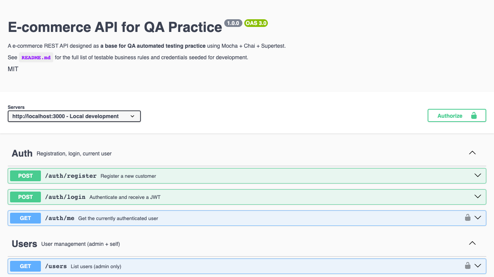

# QaShop API — E-commerce REST para Prática de automação de testes

API REST de e-commerce construída **para prática de automação de testes**, com autenticação JWT,
regras de negócio realistas, validação com Zod e documentação OpenAPI.

**Compatível com Windows 10/11, macOS e Linux.**

**Autor:** [Henrique Patti](https://www.linkedin.com/in/henrique-patti/)

**Repositório GitHub:** [github.com/HenriquePatti/api-QaShop-ecommerce](https://github.com/HenriquePatti/api-QaShop-ecommerce) · Front: [web-QaShop-ecommerce](https://github.com/HenriquePatti/web-QaShop-ecommerce)



---

## Quick start (~5 min)

1. **Node.js 20 LTS ou superior** instalado ([nodejs.org](https://nodejs.org)) — testado em 20–24
2. Na pasta `api-QaShop-ecommerce/`:

```bash
npm install
cp .env.example .env          # Windows: copy ou Copy-Item (ver tabela abaixo)
npm run prisma:generate
npm run prisma:migrate
npm run db:seed
npm run dev
```

3. **Teste:** http://localhost:3000/health → deve retornar `"status":"ok"`
4. **Swagger:** http://localhost:3000/api/docs
5. *(Opcional)* Front irmão `web-QaShop-ecommerce` → ver [Front-end opcional](#front-end-opcional)

---

## Antes de começar

| Item | Obrigatório? | Observação |
|------|:------------:|------------|
| Node.js 20+ | Sim | `node --version` · `npm --version` |
| Arquivo `.env` | Sim | Copiar de `.env.example` — ver [Compatibilidade](#compatibilidade-multiplataforma) |
| Pastas irmãs com `web-QaShop-ecommerce` | Só se for usar o front | Clone local: `../web-QaShop-ecommerce` · GitHub: [web-QaShop-ecommerce](https://github.com/HenriquePatti/web-QaShop-ecommerce) |

Comandos por SO e troubleshooting: [Compatibilidade multiplataforma](#compatibilidade-multiplataforma) · [Problemas comuns](#problemas-comuns).

---

## Objetivos

- Oferecer uma API REST (loja virtual) como alvo de testes funcionais e de contrato
- Documentar regras de negócio rastreáveis e cenários de design de teste
- Expor o contrato via **Swagger/OpenAPI** e respostas de erro padronizadas
- Servir de back-end para o front opcional **QaShop Web** (`web-QaShop-ecommerce`, repo separado)

---

## Tecnologias

| Categoria | Tecnologia |
|-----------|------------|
| Runtime | Node.js 20+ com ES Modules (`"type": "module"`) |
| Framework | Express 4 |
| Persistência | Prisma ORM + SQLite (`prisma/dev.db`) |
| Autenticação | JWT (`jsonwebtoken`) + bcrypt |
| Validação | Zod |
| Documentação | Swagger UI (`swagger-jsdoc` + `swagger-ui-express`) |
| Configuração | dotenv |
| Testes (automação) | Mocha + Chai + Supertest |

---

## Funcionalidades (testáveis)

- Cadastro e login com JWT; papéis `CUSTOMER` e `ADMIN`
- CRUD de categorias e produtos (admin); catálogo público com filtros, busca e paginação
- Carrinho por usuário com validação de estoque e produto inativo
- Cupons (`PERCENTAGE` / `FIXED`) com validação e limites de uso
- Pedidos com máquina de estados (`PENDING` → `PAID` → `SHIPPED` → `DELIVERED` / `CANCELED`)
- Snapshot de preço/nome no item do pedido; cancelamento com devolução de estoque
- Avaliações vinculadas a pedido `DELIVERED`
- Erros centralizados: `{ "error": { "code", "message", "details?" } }`

Detalhamento: [`docs/01-regras-de-negocio/regras-de-negocio.md`](docs/01-regras-de-negocio/regras-de-negocio.md)

---

## Estrutura do projeto

```
api-QaShop-ecommerce/
├── .env.example
├── package.json
├── LICENSE
├── src/
│   ├── server.js, app.js       # entrada e Express
│   ├── config/                 # env, Swagger
│   ├── lib/                    # Prisma, erros, paginação, helpers
│   ├── middlewares/            # auth, validate (Zod), errorHandler
│   └── modules/                # auth, users, categories, products,
│                               # cart, coupons, orders, reviews
│       └── */                  # routes, controller, service, schema
├── prisma/
│   ├── schema.prisma
│   ├── seed.js
│   ├── dev.db                  # criado após migrate (gitignored)
│   └── migrations/
├── tests/                      # automação (Mocha)
│   ├── setup.js                # carrega .env.test (dotenv)
│   ├── config.js               # BASE_URL, endpoints
│   ├── helpers/                # ex.: auth.js → register()
│   ├── <módulo>/               # ex.: auth/ → auth-<regra>.test.js
│   └── health/
├── .env.test.example           # template do env de testes (versionado)
├── docs/
│   ├── 01-regras-de-negocio/
│   │   └── regras-de-negocio.md
│   ├── 02-condicoes-de-teste/  # por módulo/regra
│   ├── 03-casos-de-teste/
│   └── 04-relatorios-de-execucao/
```

---

## Como executar localmente

> Já seguiu o [Quick start](#quick-start-5-min)? Pule para [Testes automatizados](#testes-automatizados-api) ou [Deu certo?](#deu-certo).

### 1. Instalar dependências

```bash
npm install
```

> **Windows:** se `npm install` falhar em `bcrypt`, instale [Build Tools C++](https://visualstudio.microsoft.com/visual-cpp-build-tools/) ou use Developer PowerShell.

### 2. Criar `.env` a partir de `.env.example`

| Sistema | Comando |
|---------|---------|
| macOS / Linux / Git Bash | `cp .env.example .env` |
| Windows (CMD) | `copy .env.example .env` |
| Windows (PowerShell) | `Copy-Item .env.example .env` |

Variáveis principais (ver `.env.example`):

| Variável | Descrição |
|----------|-----------|
| `PORT` | Porta da API (padrão `3000`) |
| `DATABASE_URL` | SQLite — após as migrations, o arquivo fica em `prisma/dev.db` |
| `JWT_SECRET` | Chave de assinatura do JWT — **altere em produção** |
| `JWT_EXPIRES_IN` | Validade do token (ex.: `1h`) |
| `BCRYPT_ROUNDS` | Custo do hash de senha |

### 3. Banco de dados e seed

```bash
npm run prisma:generate   # Gera o Prisma Client
npm run prisma:migrate    # Primeira instalação: cria o banco e aplica migrations
npm run db:seed           # Zera e repopula dados de exemplo (mesmo script do reset)
```

> Na **primeira** instalação, `prisma:migrate` cria `prisma/dev.db`. **`db:seed` apaga e recria** usuários, produtos e carrinhos. Para reset completo com migrations: `npm run db:reset` (equivale a `prisma migrate reset --force`, que roda o seed ao final).

### 4. Desenvolvimento (com watch)

```bash
npm run dev
```

- API: **http://localhost:3000**
- Raiz: `GET /` — metadados (`docs`, `health`)
- **Swagger UI:** http://localhost:3000/api/docs
- OpenAPI JSON: http://localhost:3000/api/docs.json

CORS liberado para qualquer origem (compatível com o front **QaShop Web** na porta 3001).

### 5. Produção local *(opcional)*

```bash
npm start
```

### 6. Resetar banco (ambiente QA)

```bash
npm run db:reset
```

### Scripts úteis

| Comando | Uso |
|---------|-----|
| `npm run prisma:studio` | Interface visual do SQLite |

### Validação local (pastas irmãs)

Com API e Web rodando (`npm run dev` em cada um), a partir do **diretório pai** dos dois repositórios:

```bash
bash scripts/validate-qashop.sh
```

Exemplo de layout: `Portifolio/api-QaShop-ecommerce`, `Portifolio/web-QaShop-ecommerce`, `Portifolio/scripts/validate-qashop.sh`.

---

## Testes automatizados (API)

**Stack:** Mocha + Chai + Supertest — requisições HTTP contra a API em execução, sem importar o `app` interno.

**Antes de rodar:** [Quick start](#quick-start-5-min) concluído (banco com seed) e API ligada.

### Setup (uma vez)

Ambiente de testes **separado** do `.env` da API:

| Sistema | Comando |
|---------|---------|
| macOS / Linux / Git Bash | `cp .env.test.example .env.test` |
| Windows (CMD) | `copy .env.test.example .env.test` |
| Windows (PowerShell) | `Copy-Item .env.test.example .env.test` |

Variável em `.env.test` (ver `.env.test.example`):

| Variável | Descrição |
|----------|-----------|
| `API_BASE_URL` | URL base da API para o Supertest (padrão `http://localhost:3000`) |

> Se alterar `PORT` no `.env` da API, atualize `API_BASE_URL` no `.env.test` para a mesma porta. Sem `.env.test`, os testes usam fallback `http://localhost:3000`.

### Executar

| Terminal | Comando |
|----------|---------|
| 1 | `npm run dev` |
| 2 | `npm test` — suíte Mocha |
| 2 | `npm run test:report` — suíte + relatório HTML em `tests-reports/` |

**Onde ficam os specs:** `tests/**/*.test.js` (config: `.mocharc.json`). Padrão: `tests/<módulo>/<regra>.test.js`, rastreável em `docs/03-casos-de-teste/`.

**Estrutura de suporte:**

| Arquivo | Função |
|---------|--------|
| `tests/setup.js` | Carrega `.env.test` antes dos specs (via `import` no Mocha) |
| `tests/config.js` | `BASE_URL` e constantes de endpoint |
| `tests/helpers/auth.js` | Helpers HTTP — ex.: `register(body)` |

**Dependências de ambiente:**

- API acessível em `API_BASE_URL` (padrão `http://localhost:3000`, alinhado ao `PORT` do `.env`).
- Banco com **seed** — cenários que usam dados do seed (usuários `@test.com`, etc.) exigem `npm run db:seed`.
- Specs que **criam** registros devem usar dados únicos por execução (evitar colisão).

Cobertura por regra: `docs/02-condicoes-de-teste/` e `docs/03-casos-de-teste/`

---

## Deu certo?

**API OK se:**

- http://localhost:3000/health retorna `{"status":"ok",...}`
- http://localhost:3000/api/docs abre o Swagger
- Login de teste funciona (ver credenciais abaixo)

**Primeiro acesso sugerido:** Swagger ou `POST /auth/login` com `alice@test.com` / `Alice@123`.

---

## Credenciais do seed

| Papel | E-mail | Senha |
|-------|--------|-------|
| Admin | `admin@test.com` | `Admin@123` |
| Cliente | `alice@test.com` | `Alice@123` |
| Cliente | `bob@test.com` | `Bob@123` |

**Cupons:** `WELCOME10`, `BLACKFRIDAY` (mín. R$ 200), `EXPIRED`  
**Seed:** 25 produtos (24 ativos, 1 inativo, 1 sem estoque)  
**QA negativo:** produto sem estoque `o-programador-pragmatico` · inativo `moletom-vintage-descontinuado`

---

## Endpoints (visão geral)

| Grupo | Rotas principais | Auth |
|-------|------------------|------|
| Root | `GET /` | — |
| Health | `GET /health` | — |
| Auth | `POST /auth/register`, `POST /auth/login`, `GET /auth/me` | misto |
| Users | `GET /users`, `GET/PATCH/DELETE /users/:id`, `GET /users/me/stats` | JWT |
| Categories | `GET /categories`, `GET /categories/:slug`, CRUD admin | misto |
| Products | `GET /products` (filtros: `category`, `search`, `minPrice`, `maxPrice`, `active`, `inStock`, `sort`), `GET /products/:slug`, `GET /products/by-id/:id`, `GET /products/:slug/related`, CRUD admin | misto |
| Reviews | `GET/POST /products/:productId/reviews`, `PATCH/DELETE /reviews/:id` | misto |
| Cart | `GET /cart`, `POST /cart/items`, `PATCH /cart/items/:productId`, `DELETE /cart/items/:productId`, `DELETE /cart` | JWT |
| Coupons | CRUD admin, `POST /coupons/validate` | misto |
| Orders | `GET/POST /orders`, `POST /orders/:id/{pay,ship,deliver,cancel}` | JWT |

Contrato completo: **[Swagger UI](http://localhost:3000/api/docs)**.

**Paginação:** `?page=1&pageSize=10` (máx. 100) → `{ data, meta }`.

---

## Front-end opcional

Repositório **`web-QaShop-ecommerce`** (porta **3001**). A API funciona sem o front (Swagger ou Postman).

```
sua-pasta/
├── api-QaShop-ecommerce/    ← este repo (Terminal 1 — porta 3000)
└── web-QaShop-ecommerce/          ← front (Terminal 2 — porta 3001)
```

```
Terminal 1 → api-QaShop-ecommerce → npm run dev      → http://localhost:3000  (deixar aberto)
Terminal 2 → web-QaShop-ecommerce       → npm run dev:3001 → http://localhost:3001
```

Setup do front: [README do front](https://github.com/HenriquePatti/web-QaShop-ecommerce/blob/main/README.md).

---

## Documentação de QA

| Documento | Uso |
|-----------|-----|
| [`docs/01-regras-de-negocio/regras-de-negocio.md`](docs/01-regras-de-negocio/regras-de-negocio.md) | Regras implementadas — oráculo de testes |
| [`docs/02-condicoes-de-teste/`](docs/02-condicoes-de-teste/) | Condições por regra (`COND-*`) |
| [`docs/03-casos-de-teste/`](docs/03-casos-de-teste/) | Casos por regra (`CT-*`) |
| [`docs/04-relatorios-de-execucao/`](docs/04-relatorios-de-execucao/) | Execução manual, sessões exploratórias e evidências |
| [`tests/`](tests/) | Automação funcional (Mocha) |

**Rastreabilidade:** `docs/01-regras-de-negocio` → `02-condicoes-de-teste` → `03-casos-de-teste` → `04-relatorios-de-execucao` → `tests/` (automação).

---

## Problemas comuns

| Sintoma | Solução |
|---------|---------|
| `node` / `npm` não reconhecido | Instale Node.js LTS |
| `cp` não existe (Windows CMD) | `copy` ou `Copy-Item` |
| Erro `bcrypt` no `npm install` (Windows) | [Build Tools C++](https://visualstudio.microsoft.com/visual-cpp-build-tools/) |
| Porta 3000 em uso | Altere `PORT` no `.env` |
| Migração / seed falhou | `npm run db:reset` |
| `npm test` falha com `ECONNREFUSED` | Suba a API antes: `npm run dev`; confira `API_BASE_URL` em `.env.test` vs `PORT` no `.env` |
| Teste espera conflito/duplicata mas retorna `201` | Rode `npm run db:seed` — dados do seed ausentes |
| Front com tela cinza (se usar `web-QaShop-ecommerce`) | API desligada — suba `npm run dev` aqui primeiro |

---

## Compatibilidade multiplataforma

Validado seguindo este README em **macOS**, **Linux** e **Windows** (comandos equivalentes por SO).

| Etapa | macOS / Linux | Windows |
|-------|---------------|---------|
| Copiar `.env` | `cp .env.example .env` | `copy .env.example .env` ou `Copy-Item .env.example .env` |
| Copiar `.env.test` | `cp .env.test.example .env.test` | `copy .env.test.example .env.test` ou `Copy-Item .env.test.example .env.test` |
| Instalar deps | `npm install` | Igual; se `bcrypt` falhar, instale [Build Tools C++](https://visualstudio.microsoft.com/visual-cpp-build-tools/) |
| Banco + seed | `npm run prisma:generate` → `prisma:migrate` → `db:seed` | Igual |
| Reset banco | `npm run db:reset` | Igual (PowerShell/Git Bash; no CMD use PowerShell) |
| Dev | `npm run dev` → `:3000` | Igual (`node --watch`, Node 20+) |
| Testes | `npm test` (API rodando) | Igual |
| Health check | http://localhost:3000/health | Igual |

**Checklist rápido:** `health` OK · Swagger abre · login `alice@test.com` / `Alice@123` retorna JWT.

---

## Licença

MIT — Copyright (c) [Henrique Patti](https://www.linkedin.com/in/henrique-patti/)
