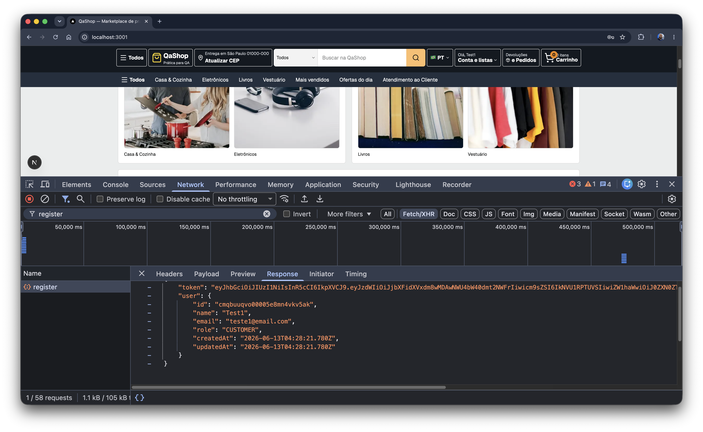
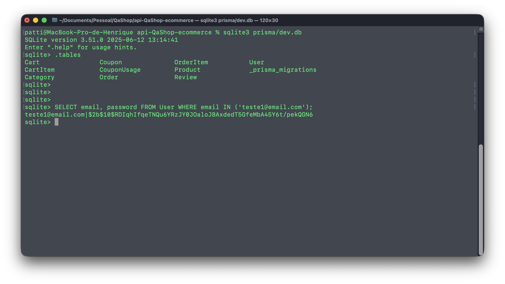
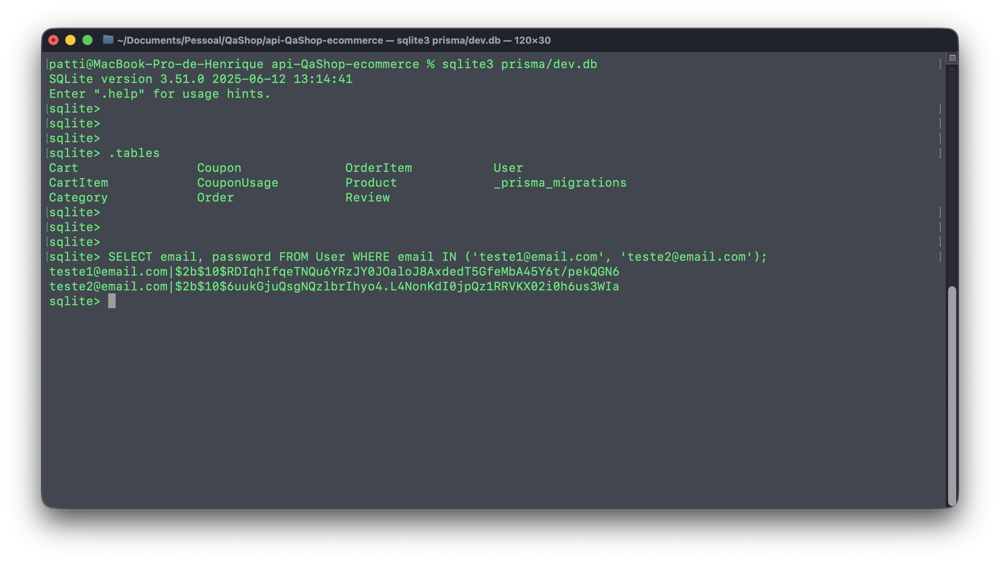
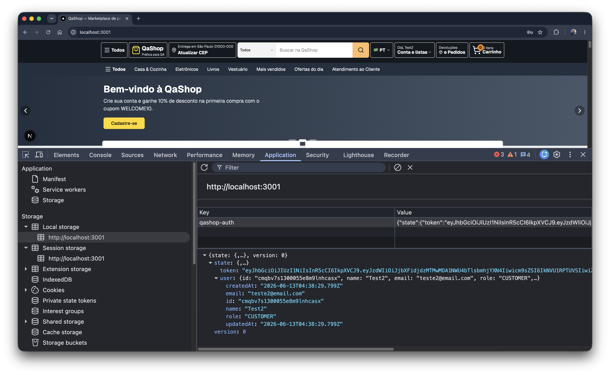

# Relatório de Sessão

> Inspirado no artigo de Jonathan Bach sobre Session-Based Test Management (2001).

| Data e Hora do Início | Nome do Testador | Módulo              |
| --------------------- | ---------------- | ------------------- |
| 13-06-2026 01:04      | Henrique Patti   | Cadastro de Usuário |

## Test Charter

**Explore** o fluxo de cadastro de usuário

**Com** acesso ao banco de dados, requisições de API e interface do sistema

**Para** descobrir como a senha é armazenada, transmitida e protegida, e se há exposição indevida da senha

## Tamanho da Sessão

90 minutos (sessão normal)

## Notas*

- (I) Resposta da chamada de cadastro de novo usuário [teste1@email.com](mailto:teste1@email.com) “Teste@123” não expõe dados sensíveis

- (I) O campo password armazenou o hash $2b$10

- (I) Cadastro de  novo usuário [teste2@email.com](mailto:teste2@email.com) com a mesma senha de [teste1@email.com](mailto:teste1@email.com) “Teste@123”  possuí hash diferentes

- (I) Após o cadastro de [teste2@email.com](mailto:teste2@email.com) inspecionei o DevTools (Application → Local storage e Session storage): a senha não está armazenada no cliente.
- (R) O token de acesso (JWT) é persistido no Local storage sob a chave `qashop-auth`, ficando suscetível a roubo via XSS.

- (R) Comportamento previsto, foi possível efetuar cadastro de usuários utilizando protocolo http:/ (comportamento previsto na criação do sistema )

## Defeitos

- Não foram identificados defeitos funcionais no fluxo de cadastro durante a sessão.
- Ressalva: o risco de segurança registrado nas Notas (token JWT persistido em Local storage — exposição a XSS) deve ser avaliado pelo time e tratado, ainda que não configure um defeito funcional.

---

(*) Podem ser (I) Informações ou (R)iscos.